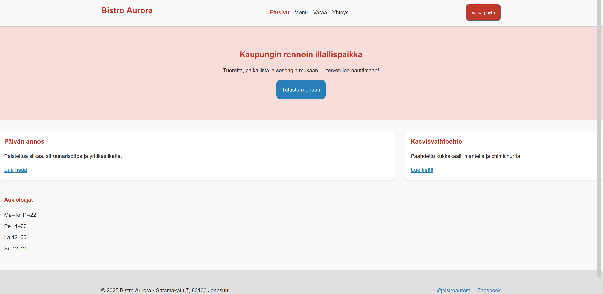

# SASS Tehtävä

Käytin SASS:issa ehkä eniten variables tiedostoa, koska se oli niin hyödyllinen kun ei tarvinut toistaa muuttujia kaikkialla.
Tuli myös käytettyä laskuoperaatioita esim. nostamaan otsikoiden tekstikokoa 1.5 kertaisiksi perus koosta.
Tykästyin myös SASS:in tapaan tehdä child/parent muokkauksia sisäkkäisellä koodilla ja &: operaatiolla. 

darken() ja lighten() oli myös todella hyödyllisiä valmiita funktioita joten käytin niitä esim: hover effektien tekemiseen. 

